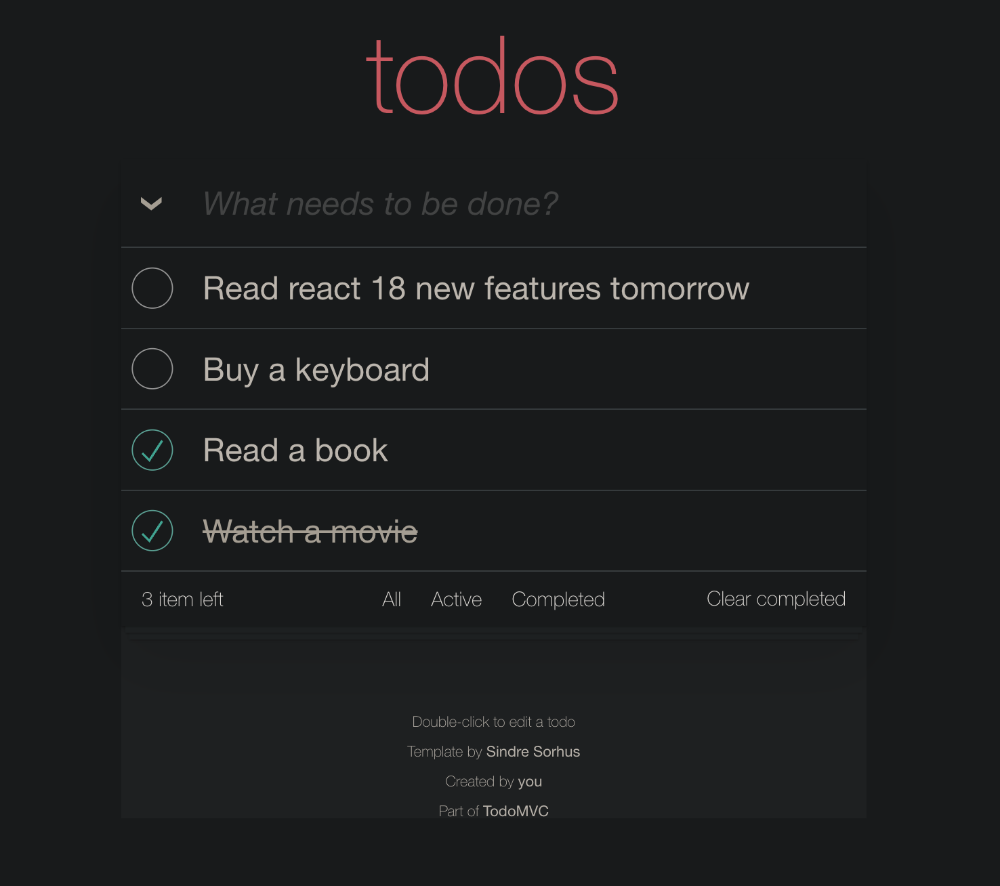

# todo-java-react

## How to start
1. init spingmvc framework follow this doc [quickstart](https://spring.io/quickstart)
2. run java project with your favoriate IDE.
3. npm i --package-lock-only
4. npm run dev

`src/main/resources/application.properties` is a basic configuration for start up a java rbac project.

## About

I learned java a couple of years ago, but in my job java is not the main program language.

So I decide to write a little project for some evidence by my java skill and for a new job.

React is my favorite frontend framework, I use it for my sparetime project very often.

This is a todo graffiti project target at practice for java, springmvc and react-18.

BTW, I have written another todo in pure javascript several years ago.
[cgxxv/todomvc](https://github.com/cgxxv/todomvc)

## Tips

A tool for intellij idea.
[ja-netfilter-all](https://github.com/libin9iOak/ja-netfilter-all)

## So

I only did this in a few hours, I wrote java rarely, from zero to a useable startup project for the frontend and backend architecture.

What is java and react? What do you think you write java or react for many years, it's nothing. That's all.

someone do not blindly evaluate a real experienced developer, because you and him or her are not in the same level.
